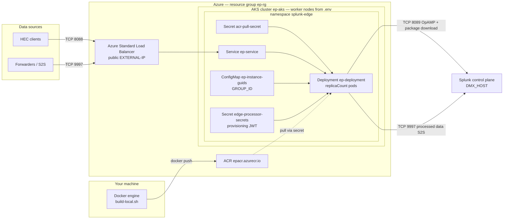

# Splunk Edge Processor on Azure AKS

---

## Prerequisites

1. **Splunk OnPrem Data Management control plane** with Edge Processor enabled
2. **Splunk token authentication** enabled on the control plane
3. **Edge Processor group** already created in Splunk UI
4. **Azure subscription** with permissions to create AKS, ACR, and Load Balancers
5. Local tools:
  - [Docker](https://docs.docker.com/engine/install/) (build images locally)
  - [Azure CLI](https://learn.microsoft.com/en-us/cli/azure/install-azure-cli) (`az`)
  - [kubectl](https://kubernetes.io/docs/tasks/tools/)
  - [Helm 3](https://helm.sh/docs/intro/install/)
  - `jq` and `curl`

**ACR name:** `ACR_NAME` in `.env` must be globally unique (lowercase alphanumeric, 5–50 chars). Example: `epacr` → `epacr.azurecr.io`.

---

## Architecture (default deploy)

Images are built on your machine with Docker, pushed to Azure Container Registry (ACR), and pulled by AKS using an **`acr-pull-secret`**.



| Layer | Default | Purpose |
| ----- | ------- | ------- |
| **AKS cluster** | `ep-aks` in `ep-rg` | Runs Kubernetes |
| **Worker nodes** | 2 × `Standard_D4s_v5` (from `.env`) | Host EP pods (Ubuntu 22.04) |
| **EP pods** | 2 (`replicaCount` in values) | One Splunk instance per pod, same Edge Processor group |
| **LoadBalancer** | `ep-service` public IP | Single entry for HEC `:8088` and S2S `:9997` |
| **Image** | `<ACR_NAME>.azurecr.io/edgeprocessor:latest` | Built locally; pulled via `acr-pull-secret` |
| **Splunk outbound** | AKS SNAT IP → `:8089`, `:9997` | Registration, packages, and exported data to your indexer |

Each pod runs `splunk-edge`, `splunksup`, and `edge_linux_amd64`. All replicas share one **GROUP_ID** from the install script and appear as separate instances under the same Edge Processor group in Splunk UI.

---

## Quick start

Complete **[Splunk control plane setup](#splunk-control-plane-setup-do-this-first)** on your Data Management host before deploying to AKS.

### 1. Clone and configure Azure

```bash
cd EP_AKS
cp env.template .env
```

Edit `.env` if needed:

| Variable | Default | Purpose |
| -------- | ------- | ------- |
| `AZURE_RESOURCE_GROUP` | `ep-rg` | Azure resource group |
| `AZURE_LOCATION` | `eastus` | Region |
| `AKS_CLUSTER_NAME` | `ep-aks` | AKS cluster name |
| `AKS_NODE_COUNT` | `2` | Worker nodes |
| `AKS_NODE_VM_SIZE` | `Standard_D4s_v5` | VM SKU (4 vCPU, 16 GiB) |
| `ACR_NAME` | `epacr` | Azure Container Registry (globally unique name) |
| `IMAGE_NAME` | `edgeprocessor` | Image name in ACR |
| `IMAGE_TAG` | `latest` | Image tag |

### 2. Splunk install script

In Splunk UI → **Manage instances** → **Install** → download and save as `install-script.txt` in the repo root.

This file contains the **provisioning JWT** (`ep-instance` audience) and `GROUP_ID` — not your HEC token.

### 3. First-time setup (once per environment)

```bash
az login
./scripts/setup-aks.sh    # creates AKS + ACR — safe to re-run; skips if already exists
```

Pick a **globally unique** `ACR_NAME` in `.env` before this step (e.g. `mycompanyepacr`).

### 4. Deploy (repeat anytime)

```bash
./scripts/deploy.sh install-script.txt
```

This single command:

1. Syncs `kubectl` credentials
2. Builds the image with local Docker (`linux/amd64`) and pushes to ACR
3. Refreshes `acr-pull-secret`
4. Runs Helm upgrade and prints HEC/S2S endpoints

**Safe to re-run** after deleting the local Docker image, deleting the image from ACR, or changing `docker/` or Splunk config.

Optional Helm sizing (`replicaCount`, CPU/memory): copy `helm/edge-processor/values-local.yaml.example` to `values-local.yaml` — `deploy.sh` auto-creates it from `.env` if missing.

### 5. Verify

1. Splunk UI → **Manage instances** → EP instances show **Healthy**
2. Open Splunk firewall for AKS **outbound SNAT IP** on **8089** (OpAMP/packages) and **9997** (S2S data)
3. Send a test HEC event using your **HEC token** from the Splunk UI (not the install-script JWT):

```bash
./scripts/show-ep-endpoints.sh   # prints curl example with LB IP
```

### Manual steps (equivalent to deploy.sh)

```bash
./scripts/build-local.sh --push
./scripts/create-acr-secret.sh
./scripts/setup-from-install-script.sh install-script.txt --apply
./scripts/show-ep-endpoints.sh
```

---

## Splunk control plane setup (do this first)

These steps run on your **Splunk Data Management control plane** host (the instance where you manage Edge Processors in the UI — not indexers/search heads alone).

### 1. TLS on management port 8089

Splunk must listen with TLS on **8089** (default for `enableSplunkdSSL`).

```bash
# In $SPLUNK_HOME/etc/system/local/server.conf
[sslConfig]
enableSplunkdSSL = true
```

Restart Splunk after changes.

### 2. Advertise HTTPS URLs (recommended)

So install scripts and package metadata use `https://` instead of `http://`:

```bash
# In $SPLUNK_HOME/etc/system/local/web.conf
[settings]
proxyHostPort = https://<DMX_HOST>:8089
```

Restart Splunk, then **re-download the install script** from the UI and confirm URLs use `https://`.

> **Note:** Even with `proxyHostPort`, OpAMP may still return `http://` package URLs. This repo’s container sets `MGMT_PROXY_ENABLED=true` by default to rewrite those locally. Do **not** set `mgmtUri` in `server.conf` — that is not the correct setting for this issue.

### 3. Enable S2S receiving on the indexer (required for data in Splunk)

The Edge Processor forwards processed data to your Splunk indexer over **S2S port 9997**. Without this, HEC returns `Success` but events never appear in Search.

On the Splunk instance that receives indexer traffic (often the same control-plane host in small deployments):

```bash
$SPLUNK_HOME/bin/splunk enable listen 9997 -auth admin:changeme
$SPLUNK_HOME/bin/splunk restart
```

**Network:** open **TCP 9997** on the Splunk host security group/firewall to your AKS cluster outbound IPs (or the NAT/LB egress used by AKS nodes).

Verify from your laptop or a debug pod:

```bash
nc -zv <DMX_HOST> 9997
```

### 4. Two different tokens (do not mix them up)

| Token | Purpose | Where to get it |
| ----- | ------- | --------------- |
| **Provisioning token** (`ep-instance`) | Pod registration, OpAMP, package download | Install script from **Manage instances**, or Tokens UI with audience `ep-instance` |
| **HEC token** | Sending events **to** the Edge Processor | Splunk UI → Edge Processor → your HEC source / receiver configuration |

The provisioning token is a long **JWT** (`eyJ...`) in the install script (`echo "eyJ..." > splunk-edge/var/token`). It is **not** the same as a generic Splunk REST API token or the HEC token used to send events.

---

## Customize deployment

### Scale EP pods (after initial deploy)

Each pod registers as **one Edge Processor instance** in Splunk (same group, shared LoadBalancer for HEC/S2S).

**Where to set it:** `helm/edge-processor/values-local.yaml`

```yaml
replicaCount: 4   # increase from default 2
```

If the file does not exist yet:

```bash
cp helm/edge-processor/values-local.yaml.example helm/edge-processor/values-local.yaml
```

**Apply the change:**

```bash
./scripts/deploy.sh install-script.txt --skip-build
```

**Verify:**

```bash
kubectl get pods -n splunk-edge
```

Splunk UI → Edge Processor → your group → **Instances** — new pods should show **Healthy**.

**Capacity check:** default resources are **2 CPU / 2 GiB request per pod**. Before raising `replicaCount`, ensure worker nodes have enough schedulable capacity:

```
replicaCount × resources.requests.cpu   ≤  total node vCPU (minus ~1 vCPU system overhead per node)
replicaCount × resources.requests.memory ≤ total node memory (minus system overhead)
```

Example: 4 pods × 2 CPU = **8 CPU** requested → needs enough nodes (e.g. 3 × `Standard_D4s_v5` = 12 vCPU total).

If pods stay **`Pending`** with `Insufficient cpu` or `Insufficient memory`, add AKS nodes (below) or lower `resources` in `values-local.yaml`.

---

### Scale AKS worker nodes (after initial deploy)

Worker node count is set in `.env` as `AKS_NODE_COUNT` at **first cluster create** only. **`setup-aks.sh` does not resize an existing cluster** — it skips create if the cluster already exists.

**To add nodes after deploy:**

```bash
az aks scale \
  --resource-group ep-rg \
  --name ep-aks \
  --node-count 5
```

Update `.env` to match so your records stay accurate:

```bash
AKS_NODE_COUNT=5
```

**Verify:**

```bash
kubectl get nodes
```

**Changing VM size** (`AKS_NODE_VM_SIZE`) on a running cluster requires adding a new node pool or recreating the cluster — `az aks scale` only changes **count**, not SKU.

---

### Recommended scaling order

1. Check current usage: `kubectl get pods -n splunk-edge` and `kubectl describe nodes`
2. **Add AKS nodes** if pods are Pending or nodes are full
3. **Increase `replicaCount`** in `values-local.yaml`
4. **Redeploy:** `./scripts/deploy.sh install-script.txt --skip-build`
5. Confirm new instances are **Healthy** in Splunk UI

---

### Azure node pool (initial create)

Set in `.env` (from `env.template`) before the first `./scripts/setup-aks.sh`:

| Variable | Default | Purpose |
| -------- | ------- | ------- |
| `AKS_NODE_COUNT` | `2` | Worker nodes (initial create only) |
| `AKS_NODE_VM_SIZE` | `Standard_D4s_v5` | VM SKU (4 vCPU, 16 GiB) |
| `ACR_NAME` | `epacr` | Creates ACR; image pulls use `acr-pull-secret` |
| `AKS_K8S_VERSION` | (latest) | Optional Kubernetes version |

Node OS is **Ubuntu 22.04** (AKS managed image). EP **container** OS is **Ubuntu 22.04** in `docker/Dockerfile`.

---

### Kubernetes / EP pods (Helm)

Copy the example overrides file and edit:

```bash
cp helm/edge-processor/values-local.yaml.example helm/edge-processor/values-local.yaml
```

| values key | Controls |
| ---------- | -------- |
| `replicaCount` | Fixed EP pod count (default 2) — see [Scale EP pods](#scale-ep-pods-after-initial-deploy) |
| `image.repository` / `tag` | ACR image (must match `build-local.sh --push`) |
| `resources` | CPU/memory per pod |
| `strategy.rollingUpdate.maxSurge` | `0` = no extra pod during rollouts (avoids ghost Splunk instances) |
| `service.annotations` | e.g. internal Azure Load Balancer |
| `terminationGracePeriodSeconds` | Time for Splunk offboard on pod shutdown |

Splunk-specific settings (`dmxHost`, package URL, `groupId`, etc.) come from **`values-install.yaml`**, generated by `setup-from-install-script.sh`.

---

### Clean up disconnected Splunk instances

Old pods (force-deleted rollouts, scaled-down replicas) may remain as **Disconnected** in Splunk UI while current pods show **Healthy**.

- **List via API:** `GET .../edge/v1alpha3/processors/{GROUP_ID}` → `instanceStatus[]`
- **Remove disconnected orphans:** Splunk UI → Edge Processor → your group → **Instances** → Actions → **Delete instance** (only rows with status **Disconnected**)
- **Do not** `DELETE .../processors/{GROUP_ID}` via API — that removes the entire Edge Processor group

To prevent new ghosts: keep `strategy.rollingUpdate.maxSurge: 0` and avoid `kubectl delete pod --force` on running EP pods.

---

## Cleanup

```bash
kubectl delete namespace splunk-edge
az aks delete --resource-group ep-rg --name ep-aks --yes
az group delete --name ep-rg --yes
```

