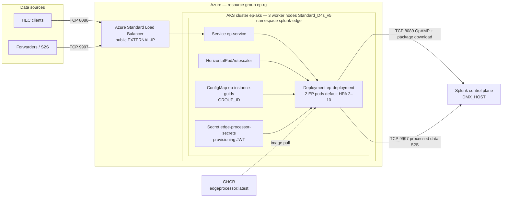

# Splunk Edge Processor on Azure AKS

---

## Prerequisites

1. **Splunk OnPrem Data Management control plane** with Edge Processor enabled
2. **Splunk token authentication** enabled on the control plane
3. **Edge Processor group** already created in Splunk UI
4. **Azure subscription** with permissions to create AKS, ACR, and Load Balancers
5. Local tools:
  - [Azure CLI](https://learn.microsoft.com/en-us/cli/azure/install-azure-cli) (`az`)
  - [kubectl](https://kubernetes.io/docs/tasks/tools/)
  - [Helm 3](https://helm.sh/docs/intro/install/)
  - GitHub PAT with `read:packages` (for private GHCR image)
  - `jq` and `curl`

---

## Architecture (default deploy)

After the quick start flow, Azure and Kubernetes look like this:



| Layer | Default | Purpose |
| ----- | ------- | ------- |
| **AKS cluster** | `ep-aks` in `ep-rg` | Runs Kubernetes |
| **Worker nodes** | 3 × `Standard_D4s_v5` | Host EP pods (Ubuntu 22.04) |
| **EP pods** | 2 (HPA scales 2–10) | One Splunk instance per pod, same Edge Processor group |
| **LoadBalancer** | `ep-service` public IP | Single entry for HEC `:8088` and S2S `:9997` |
| **Image** | `ghcr.io/.../edgeprocessor:latest` | Built by GitHub Actions; pulled via `registry-pull-secret` |
| **Splunk outbound** | AKS SNAT IP → `:8089`, `:9997` | Registration, packages, and exported data to your indexer |

Each pod runs `splunk-edge`, `splunksup`, and `edge_linux_amd64`. All replicas share one **GROUP_ID** from the install script and appear as separate instances under the same Edge Processor group in Splunk UI.

---

## Quick start

Complete **Splunk control plane setup** below first, then:

```bash
cd EP_AKS
cp env.template .env
# Splunk UI → Manage instances → Install → save as install-script.txt

az login
./scripts/setup-aks.sh
./scripts/create-ghcr-secret.sh YOUR_GITHUB_USER ghp_<pat>
./scripts/setup-from-install-script.sh install-script.txt --apply
./scripts/show-ep-endpoints.sh
```

**Optional** — change node size/count or pod replicas before deploy:

```bash
cp helm/edge-processor/values-local.yaml.example helm/edge-processor/values-local.yaml
# edit .env (AKS_NODE_COUNT, AKS_NODE_VM_SIZE) and/or values-local.yaml (hpa, resources)
```

**Verify**

- Splunk UI → Manage instances → instances **Healthy**
- HEC test uses your **HEC token** (not the JWT from the install script)
- Open Splunk firewall for new AKS **outbound SNAT IP** on ports **8089** and **9997**

**Redeploy** (cluster already exists):

```bash
az aks get-credentials --resource-group ep-rg --name ep-aks --overwrite-existing
./scripts/setup-from-install-script.sh install-script.txt --apply
./scripts/show-ep-endpoints.sh
```

---

## Splunk control plane setup (do this first)

These steps run on your **Splunk Data Management control plane** host (the instance where you manage Edge Processors in the UI — not indexers/search heads alone).

### 1. TLS on management port 8089

Splunk must listen with TLS on **8089** (default for `enableSplunkdSSL`).

```bash
# In $SPLUNK_HOME/etc/system/local/server.conf
[sslConfig]
enableSplunkdSSL = true
```

Restart Splunk after changes.

### 2. Advertise HTTPS URLs (recommended)

So install scripts and package metadata use `https://` instead of `http://`:

```bash
# In $SPLUNK_HOME/etc/system/local/web.conf
[settings]
proxyHostPort = https://<DMX_HOST>:8089
```

Restart Splunk, then **re-download the install script** from the UI and confirm URLs use `https://`.

> **Note:** Even with `proxyHostPort`, OpAMP may still return `http://` package URLs. This repo’s container sets `MGMT_PROXY_ENABLED=true` by default to rewrite those locally. Do **not** set `mgmtUri` in `server.conf` — that is not the correct setting for this issue.

### 3. Enable S2S receiving on the indexer (required for data in Splunk)

The Edge Processor forwards processed data to your Splunk indexer over **S2S port 9997**. Without this, HEC returns `Success` but events never appear in Search.

On the Splunk instance that receives indexer traffic (often the same control-plane host in small deployments):

```bash
$SPLUNK_HOME/bin/splunk enable listen 9997 -auth admin:changeme
$SPLUNK_HOME/bin/splunk restart
```

**Network:** open **TCP 9997** on the Splunk host security group/firewall to your AKS cluster outbound IPs (or the NAT/LB egress used by AKS nodes).

Verify from your laptop or a debug pod:

```bash
nc -zv <DMX_HOST> 9997
```

### 4. Two different tokens (do not mix them up)

| Token | Purpose | Where to get it |
| ----- | ------- | --------------- |
| **Provisioning token** (`ep-instance`) | Pod registration, OpAMP, package download | Install script from **Manage instances**, or Tokens UI with audience `ep-instance` |
| **HEC token** | Sending events **to** the Edge Processor | Splunk UI → Edge Processor → your HEC source / receiver configuration |

The provisioning token is a long **JWT** (`eyJ...`) in the install script (`echo "eyJ..." > splunk-edge/var/token`). It is **not** the same as a generic Splunk REST API token or the HEC token used to send events.

---

## Customize deployment

### Azure node pool (VM size, count, OS)

Set in `.env` (from `env.template`), then create the cluster:

| Variable | Default | Purpose |
| -------- | ------- | ------- |
| `AKS_NODE_COUNT` | `3` | Worker nodes |
| `AKS_NODE_VM_SIZE` | `Standard_D4s_v5` | VM SKU (4 vCPU, 16 GiB) |
| `AKS_K8S_VERSION` | (latest) | Optional Kubernetes version |

```bash
cp env.template .env
# edit AKS_NODE_COUNT, AKS_NODE_VM_SIZE
./scripts/setup-aks.sh
```

Node OS is **Ubuntu 22.04** (AKS managed image). EP **container** OS is **Ubuntu 22.04** in `docker/Dockerfile`.

### Kubernetes / EP pods (Helm)

Copy the example overrides file and edit:

```bash
cp helm/edge-processor/values-local.yaml.example helm/edge-processor/values-local.yaml
```

| values key | Controls |
| ---------- | -------- |
| `replicaCount` | Pod count when `hpa.enabled: false` |
| `hpa.minReplicas` / `maxReplicas` | Autoscaling bounds (default 2–10) |
| `hpa.enabled` | Set `false` for a fixed pod count |
| `resources` | CPU/memory per pod |
| `image.repository` / `tag` | Container image |
| `strategy.rollingUpdate.maxSurge` | `0` = no extra pod during rollouts (avoids 3rd Splunk instance) |
| `service.annotations` | e.g. internal Azure Load Balancer |
| `terminationGracePeriodSeconds` | Time for Splunk offboard on pod shutdown |

Splunk-specific settings (`dmxHost`, package URL, `groupId`, etc.) come from **`values-install.yaml`**, generated by `setup-from-install-script.sh`.

---

## Cleanup

```bash
kubectl delete namespace splunk-edge
az aks delete --resource-group ep-rg --name ep-aks --yes
az group delete --name ep-rg --yes
```

